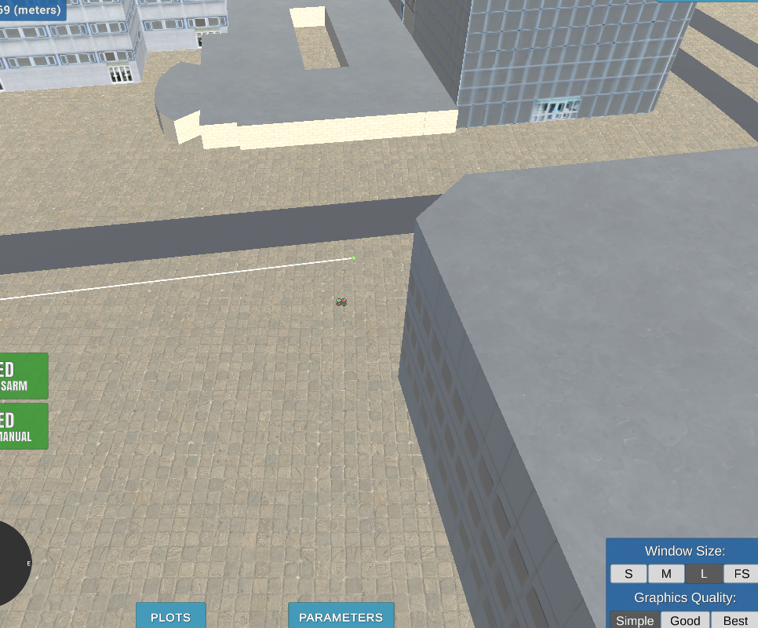

## Project: 3D Motion Planning


---
# Required Steps for a Passing Submission:
1. Load the 2.5D map in the colliders.csv file describing the environment.
2. Discretize the environment into a grid or graph representation.
3. Define the start and goal locations.
4. Perform a search using A* or other search algorithm.
5. Use a collinearity test or ray tracing method (like Bresenham) to remove unnecessary waypoints.
6. Return waypoints in local ECEF coordinates (format for `self.all_waypoints` is [N, E, altitude, heading], where the drone’s start location corresponds to [0, 0, 0, 0].
7. Write it up.
8. Congratulations!  Your Done!

## IMPORTANT NOTE!
There are two implementations of path planning in this repository. motion_planning.py and planning_utils.py are using a Voronoi graph based representation of the environment to plan the path, while motion_planning_grid.py and planning_utils_grid.py implement a grid based representation of the environment and plan a path through that. 


## [Rubric](https://review.udacity.com/#!/rubrics/1534/view) Points
### Here I will consider the rubric points individually and describe how I addressed each point in my implementation.  

---
### Writeup / README

#### 1. Provide a Writeup / README that includes all the rubric points and how you addressed each one.  You can submit your writeup as markdown or pdf.  

You're reading it! Below I describe how I addressed each rubric point and where in my code each point is handled.

### Explain the Starter Code

#### 1. Explain the functionality of what's provided in `motion_planning.py` and `planning_utils.py`

motion_planning.py includes:
- event-driven programming for the drone 
- includes different states: same as last backyard flyer with additional planning state
- most code is very similar to the backyard flyer code 
- state callback: when flight state is in PLANNING -> TAKEOFF
- arming_transition doesnt set home position
- takeoff_transition takeoffs to target altitiude given by self.target_position[2]
- new function: plan_path to search for a waypoints that will get the drone to target position 
  - TODOS:
    - set home position + get global/local position 
    - adapt goal position 
    - Run A* and optimize it to have diagonal motions 
    - Prune path w/ Bresenham or Colinearity 
    - Send waypoints 

planning_utils.py includes similar methods to the exercises in the Planning lessons in the course:
- create_grid(data, drone_altitiude, safety_distance) method - given the map data, creates a 2D config space w/ obstacles 
- class Action that has West, East, North, South actions
- valid_actions(grid, current_node) returns the actions that are possible on that node from Action class
- a_star(grid, h, start, goal) - implements a* algorithm with a given grid map, heuristic, and start/goal, uses actions from Action class to get from one grid space to another
- heurstic function that is just the euclidean distance b/w nodes 


### Implementing Your Path Planning Algorithm

#### 1. Set your global home position
Here students should read the first line of the csv file, extract lat0 and lon0 as floating point values and use the self.set_home_position() method to set global home. Explain briefly how you accomplished this in your code.
```
lines = open('colliders.csv').readline().split(", ")
lat0 = float(lines[0].split(" ")[1])
lon0 = float(lines[1].split(" ")[1])

# set home position to (lon0, lat0, 0)
self.set_home_position(lon0, lat0, 0.0)
```

First, lines variable reads the first line from colliders.csv and splits it by the comma, so it returns a list of strings: ["lat0 37.792480", "lon0 -122.397450"]

Then, each entry in the list gets split by spaces, and the second entry of the lat0 and lon0 are converted into floats and assigned to lat0 and lon0 variables. 

Once you have lat0 and lon0, call set_home_position with the longitude, latitude, and 0 as the altitude. 

#### 2. Set your current local position
Here as long as you successfully determine your local position relative to global home you'll be all set. Explain briefly how you accomplished this in your code.

```
# retrieve current global position
current_global = self.global_position

# convert to current local position using global_to_local()
current_local = global_to_local(current_global, self.global_home)
```

1. Get drone's current position using the global_position property 
2. Using global_to_local(), convert the current global position to the current LOCAL position by passing in the current global position and the global home position so the function returns the LOCAL position RELATIVE to the drone's global home.

#### 3. Set grid start position from local position
This is another step in adding flexibility to the start location. As long as it works you're good to go!

```grid_start = (int(current_local[0] - north_offset), int(current_local[1]-east_offset))```

When creating your grid (grid representation) or grid and edges (Voronoi graph representation) in the planning_utils python file, the function also returns the north and east offset, which is also the north_min and east_min values for the graph. To get the grid start position, you just subtract the north offset from the 0th index of the local position (north of local position in environment), and subtract the east offset from the 1st index of the local position (east of local position). This subtraction is to get the local position that is currently relative to the home position, to be positioned relative to the grid coordinates that start from 0,0 instead of -316,-445 (or something similar).

#### 4. Set grid goal position from geodetic coords
This step is to add flexibility to the desired goal location. Should be able to choose any (lat, lon) within the map and have it rendered to a goal location on the grid.

This code is similar to computing the grid start method. I created a seperate method for it called global_to_grid that takes in the latitude, longitude, and the north and east offsets. 
Given a latitude and longitude in the code, you can use global_to_local to convert the global goal position into a local goal position with respect to the home position. Then, to get the goal position in terms of the grid, do the same as step 3 for the local goal and subtract the north offset from the 0th index of the local goal position (north of local position in environment), and subtract the east offset from the 1st index of the local goal position (east of local position).

#### 5. Modify A* to include diagonal motion (or replace A* altogether)
Minimal requirement here is to modify the code in planning_utils() to update the A* implementation to include diagonal motions on the grid that have a cost of sqrt(2), but more creative solutions are welcome. Explain the code you used to accomplish this step.

##### Grid Method - Diagonal Motions 
1. In the Action class, add new action enums like NE, NW, SE, SW, with delta x and y's to correspond to the action, and have each cost of the diagonal actions to be sqrt(2)
2. In the valid_actions method, add all the actions and remove them if they cannot be reached, similar to the existing code for the N, W, S, E actions 
3. In the A* method, rest of the code is the same but valid actions now contain diagonals!

##### Voronoi Graph Method
1. For the Voronoi graph, a networkx graph was passed into the A* algorihtm instead of a 2D list that represents the grid environment. This means that there arent actions to take, but points on the graph that can represent potential waypoints on the path.
2. Most of the code is the same, except instead of iterating through the valid actions, the code iterates through the possible neighbor points in the graph with ```for neighbor in graph[current_node]:```


#### 6. Cull waypoints 
For this step you can use a collinearity test or ray tracing method like Bresenham. The idea is simply to prune your path of unnecessary waypoints. Explain the code you used to accomplish this step.
**Only done in grid implementation of path planning because graph implementation requires no pruning.**

```
def prune_path(path):
    pruned_path = path
    
    i = 0
    while i < len(pruned_path) - 2:
        p1 = point(pruned_path[i])
        p2 = point(pruned_path[i+1])
        p3 = point(pruned_path[i+2])
        
        if collinearity_check(p1, p2, p3):
            pruned_path.remove(pruned_path[i+1])
        else:
            i += 1
    return pruned_path
```
1. The pruned path starts off as the original branch. 
2. Iterate through 3 consecutive points, and if they are collinear, then remove the middle point and repeat with the 3 next points (including the beginning and last points)
3. To check for colinnearity, calculate determinants with np.linalg.det() function and check if its close enough to 0 (within episilon of 0).

### Execute the flight
#### 1. Does it work?
It works!

### Double check that you've met specifications for each of the [rubric](https://review.udacity.com/#!/rubrics/1534/view) points.


Grid


Voronoi

